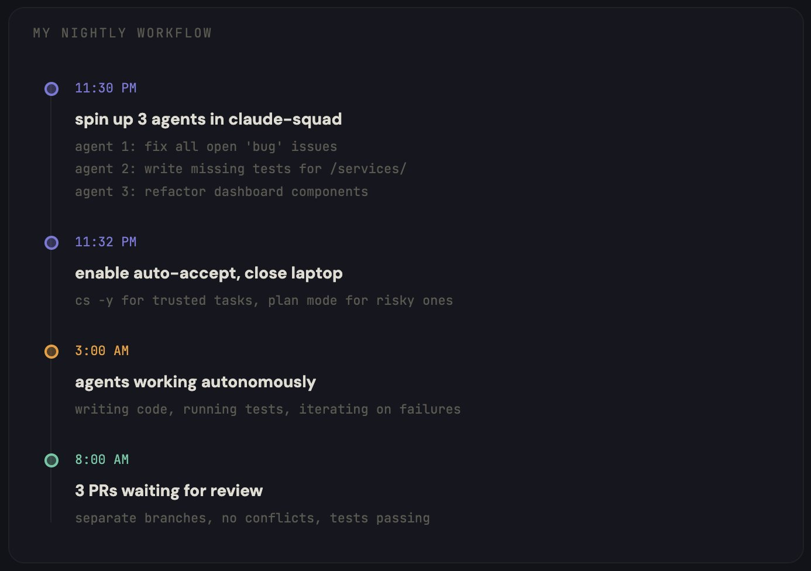
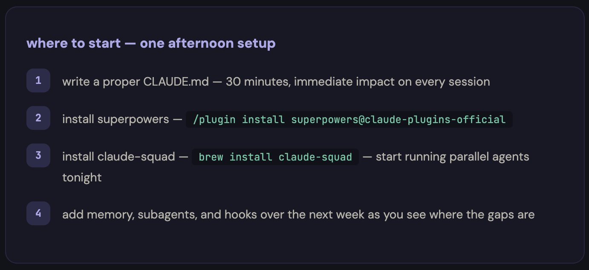

---
# 构建可记忆、可协作、可持续进化的 Claude 开发工作流

大多数人把 Claude Code 当作聊天机器人来使用。而我却把它改造成了一个持久化、可协作、持续进化的智能辅助系统，该系统能记住所有上下文，并在每次交互后变得更适配我的工作流。

我在前三个月里一直错误地大量使用 Claude Code。

每次会话的开头都是一样的：“我正在用 TypeScript 构建一个 React 应用，使用 PostgreSQL 数据库，部署在 Vercel 上，这是我的项目目录结构……”

同样的解释一遍又一遍，每天如此。

然后我会手动输入相同的指令：“检查这段代码。”“为这段代码写测试。”“修复 CI 流程。”我把一整段文字敲进终端里，但只要我一关闭终端，它就会忘记所有内容。

我统计过一周的情况：每天有 47 分钟浪费在向一个本该了解我的工具重复说明上。

后来，我从头开始重新搭建了我的整个开发环境。

现在，Claude Code 能记住我做过的每一个决定。在我睡觉的时候，它可以并行运行多个 Agent；它会自动执行我的编码规范，无需我额外提醒。而且，每次会话结束后，它都会基于历史交互优化后续响应，而不是重置回初始状态。

整个系统只需要每月 20 美元的订阅费用。

下面就是我一步步搭建它的完整过程。

## /第 1 部分 - CLAUDE.md：改变一切的基础

这是 90% 的用户要么直接跳过、要么写错的文件。

CLAUDE.md 存放在你的项目根目录下。Claude Code 每次会话开始时都会读取它。它是你用来告诉 Claude 你是谁、你在构建什么以及你希望如何完成工作的方式——一次设定，永久生效。

大多数人写的可能是这样的：“这是一个 React 应用，请多帮忙。”

这种写法毫无意义。

以下才是真正有效的写法：

```
# CLAUDE.md

## 项目
- 技术栈：Next.js 14、TypeScript、Tailwind CSS、通过 Prisma 使用 PostgreSQL
- 部署在 Vercel 上，staging 分支会自动部署
- 单体仓库：/apps/web、/apps/api、/packages/shared

## 规范
- 所有组件采用 PascalCase 命名
- API 路由返回 { data, error } 格式
- 除了页面之外，不使用默认导出
- 测试文件与源码文件同目录存放，命名格式为 *.test.ts
- 提交遵循 conventional commits 规范（feat:、fix:、chore: 等）

## 架构决策
- 2024 年 12 月选择 Prisma 而不是 Drizzle：优先考虑类型安全
- 2025 年 1 月选择 Zustand 而不是 Redux：减少样板代码
- 使用 Clerk 进行身份验证，而非 NextAuth：更适合我们团队规模的开发体验

## 当前重点
- 将支付系统从 Stripe Checkout 运行模式迁移到 Stripe Elements
- 对 /dashboard 进行性能审计（目标：LCP < 2 秒）

## 规则
- 未经提前展示计划，绝不批量修改超过 3 个文件
- 在编写新测试之前，务必先运行现有测试
- 如果任务需要超过 5 个步骤，则必须先创建一份计划文档
```

效果简直是天壤之别。不再需要每会话开始的前 5 分钟都在解释你的项目，因为 Claude 已经清楚你的技术栈、编码规范、架构决策以及当前的工作重点。

但这仅仅是个开始。CLAUDE.md 是静态的，它不会学习，也不会成长。要做到这一点，还需要下一层次的设置。

## /第 2 部分 - 持久化存储：永不遗忘的配置

这部分彻底改变了我的开发方式。

默认情况下，Claude Code 在不同会话之间没有任何记忆。每次对话都从零开始。你需要反复解释相同的上下文、做出同样的修正、重新发现同样的解决方案。

我通过三种工具协同工作解决了这个问题。


**Obsidian 作为知识库**

我专门为我的开发工作搭建了一个 Obsidian 仓库。这不是普通的笔记或书签，而是一个结构化的 Wiki，Claude Code 可以从中读取和写入数据。

仓库的结构如下：

```
/vault
  /decisions      — 包含所有带背景信息的架构决策
  /errors         — 我们遇到的 bug 及其解决方法
  /patterns       — 在我们的代码库中行之有效的代码模式
  /sessions       — 每日会话摘要
  /stack           — 我们使用的每种工具的文档
  Memory.md       — 关于我本人、我正在构建的内容以及我的偏好
  index.md        — 仓库内所有内容的总索引
```

这一思路源自 Andrej Karpathy 的 LLM Wiki 概念——与其让 Claude 每次会话都从头开始重新发现知识，不如让它从一个可以不断积累知识的持久化 Wiki 中读取信息。

> https://github.com/karpathy/llm-wiki

**claude-mem 实现会话持久化**

claude-mem 通过压缩技术为 Claude 添加了长期记忆。每次会话结束时，它会将关键决策和上下文压缩成一个持久化的存储，以便在下一次会话中继续使用。

> https://github.com/thedotmack/claude-mem

**subconscious agent**

claude-subconscious 是一个后台 Agent，它会监控你的会话、读取你的文件，并在你不知不觉中逐步建立记忆。

这就像是有一个初级开发人员坐在你身后，记录下你做的每一件事。

> https://github.com/0xfurai/claude-subconscious

结果就是：周一早上打开 Claude Code 时，它已经知道周五我在调试支付 Webhook 中的竞态条件，当时我决定从轮询切换到 WebSocket，并且我还需更新测试用例。无需任何解释，它已经完全掌握这些信息。

## /第 3 部分 - Skills：将通用助手转变为专业助手

开箱即用的 Claude Code 是一个通用助手，它什么都能做，但没有哪一项做得特别出色。

Skills 就能改变这一点。它们是 Markdown 文件，用于教会 Claude 如何按照你期望的方式完成特定任务。

每个人都应该首先安装的是 Superpowers。

该项目拥有 17 万+ GitHub 星标，已正式入驻 Anthropic 插件市场。它能够将 Claude Code 从“接到请求就写代码”转变为一套完整的开发方法论。

```
/plugin install superpowers@claude-plugins-official
```

Superpowers 的实际作用是：Claude 不会直接开始写代码，而是会强制执行一个工作流程——头脑风暴 → 规格制定 → 计划制定 → TDD → 实现 → 审查。Claude 会先询问你到底想构建什么，然后为你撰写一份待你批准的规格说明书，接着生成一份详细到足以让初级开发人员执行的计划，最后再以测试驱动开发的方式进行实现。

> https://github.com/obra/superpowers

在 Superpowers 之后，我又添加了几个专门的 Skills：

> Trail of Bits 安全技能——由真正的安全工程师构建的真实安全审计工作流程。每个 PR 在我查看之前，都会先被扫描是否存在漏洞。

> https://github.com/trailofbits/claude-code-skills

> Anthropic 官方 Skills——PDF、DOCX、XLSX 生成以及数据分析。这是其他所有技能的参考标准。

> https://github.com/anthropics/skills

> tdd-guard——自动阻止未通过测试的提交。Claude 根本无法发布未经测试的代码。它还会解释为什么会被阻止，以及需要哪些测试。

> https://github.com/nizos/tdd-guard

你可以叠加任意数量的 Skills，它们之间互不冲突。每个 Skill 都能让 Claude 在某一方面表现得更好，而这些 Skills 组合在一起，就能形成一个熟悉你具体工作流程的专业助手。

## /第 4 部分 - Subagents：一个 Claude 可以变成多个专业化 Agent

这才是真正的核心。

单个 Claude Code 会话在同一时间只能做一件事。你要它先写功能，再审查代码，然后修复 Bug，最后写文档——它会依次完成每一项任务，但到了第四项时，上下文就已经被污染了。

Subagents 则可以将工作分解开来。与其让一个超负荷的 Claude 来处理所有事情，不如组建一个由多个专业 Agent 组成的协作工作流，每个 Agent 都有自己的上下文和单一职责。

我的配置使用了五个 Agent：

- **Architect**——负责高层次的设计决策、撰写规格说明书以及规划实现方案。它从不直接接触代码。
- **Coder**——根据 Architect 的计划编写实际代码。拥有完整的工具访问权限。
- **Reviewer**——以安全第一的原则审查每一个 PR。标记问题、提出改进建议，并检查测试覆盖率。
- **Tester**——编写并运行测试，严格执行 TDD。与 tdd-guard 紧密合作，确保所有代码都有充分的测试覆盖。
- **Ops**——负责部署、CI/CD 和基础设施。监控构建过程，修复失败问题。

每个 Agent 都有自己的 CLAUDE.md，其中包含具体的指令、工具权限和上下文边界。Coder 绝不会看到部署配置，Reviewer 也绝不会编写代码。这样实现了清晰的职责分离。

对于现成的 Agent 集合：

> https://github.com/wshobson/agents——2.5 万+ 颗星，涵盖战略、开发、安全和设计等多个领域的生产级 Subagents
> https://github.com/davepoon/claude-code-subagents-collection——100 多个 Agent，可直接用于任何工作流程

## /第 5 部分 - Hooks 和 Slash 命令：自动化重复性工作

每当你发现自己第三次输入相同的指令时，就意味着有一个 Slash 命令正等待着被创建。

我设置了以下命令，并每天都在使用：

> /fix-issue 456——读取 GitHub Issue，创建分支，编写修复代码并附带测试，然后打开 PR。只需一条命令，就能代替耗时 10 分钟的工作流程。

> https://github.com/claude-commands/command-fix-issue

> /review——触发 Reviewer Agent，对当前 PR 进行安全检查、测试覆盖率分析以及代码质量评分。

> /deploy staging——通过 Ops Agent 运行完整的部署流水线。

关于一套完整的 57 个可用于生产的命令集合：

> https://github.com/wshobson/commands——1.7 万+ 颗星，涵盖 15 种工作流程和 42 种工具。

Hooks 则更进一步，它们会在特定时刻自动触发：

> pre-commit hook——tdd-guard 会在任何提交进入版本库之前，检查测试是否存在且通过。
> session start hook——从 Obsidian 加载记忆，读取最近的会话日志，准备好上下文。
> pre-push hook——在代码推送到远程仓库之前，自动进行安全审查。

你再也不需要反复提醒 Claude 你的规则，因为这些规则会自动执行。

## /第 6 部分 - 编排与成本分析

这是最后一环。它让每月 20 美元的订阅变成了一套可并行、可持久、可复用的多 Agent 协作工作流。

claude-squad 是一个专为并行运行多个 AI Agent 而设计的终端多路复用器。每个 Agent 都通过 Git worktrees 获得独立的工作空间，因此它们可以在不同的分支上工作，互不干扰。

```
brew install claude-squad
cs
```

就这样，你就得到了一个 TUI 界面，可以在上面启动、监控、暂停和恢复 Agent。关闭终端后，它们会继续工作。第二天早上回来，你会看到已完成的 Pull Request。

> https://github.com/smtg-ai/claude-squad



睡前，我会打开 claude-squad，启动三个会话：

- Agent 1：“修复仓库中所有标记为 'bug' 的未解决问题”  
- Agent 2：“为 /apps/api/src/services/ 缺失的模块编写测试”  
- Agent 3：“将仪表板组件重构为使用新的设计令牌”

我为信任的任务启用了自动接受模式（`cs -y`），而对于风险较高的任务则切换到计划模式。

随后关闭笔记本电脑，安心入睡。

第二天早上醒来，发现有三份 PR 正在等待审核。每份 PR 都位于各自的分支上，没有任何冲突，测试也都顺利通过。

如需更高级的编排能力：

> https://github.com/ruvnet/claude-flow——11.4 万+ 颗星，提供企业级的多 Agent 编排能力，并支持持久化记忆。

以下是所有组件协同工作的整体架构与成本构成：

```
第 1 层：CLAUDE.md              — 免费（仅是一个文件）
第 2 层：Obsidian + claude-mem  — 免费（Obsidian 是免费的，代码库均为开源）
第 3 层：Superpowers + Skills   — 免费（全部开源，MIT 许可证）
第 4 层：Subagents              — 免费（Markdown 文件）
第 5 层：Hooks + Commands       — 免费（全部开源）
第 6 层：claude-squad           — 免费（开源）

基础设施总成本：$0

Claude Code 订阅费用：$20/月（Pro 方案）
```

这份清单上的所有内容都是开源的。你唯一需要付费的就是 Claude Code 的订阅本身。

而其投资回报率更是远超预期。我在实施这套方案前后分别追踪了两周的生产力数据：


每天浪费的 47 分钟？消失了。但更重要的是，这些智能体现在能在凌晨 3 点完成我过去下午 3 点才做的工作。

## /bonus - 从哪里开始

你不必今天就搭建完全部六层架构。

先从这三层开始吧。只需要一个下午的时间：



这个设置是我花了 3 个月才摸索出来的。

其实你只需一个下午就能搭建好。
