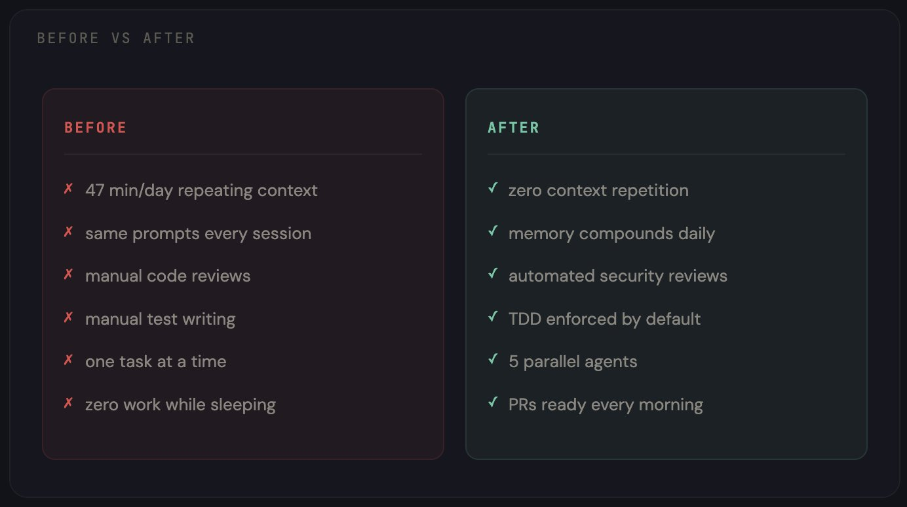

# 如何将我的 Claude 代码工具变成 24/7 全天候开发团队（完整指南 + 仓库）

大多数人把 Claude 代码当作聊天机器人来使用。而我则把它改造成了一个能记住一切、每次会话都会变得更聪明的 24/7 全天候开发团队。

请收藏本文，以免忘记。

我在前三个月里一直错误地大量使用 Claude 代码：

每次会话都从同样的开场白开始：“我正在用 TypeScript 构建一个 React 应用，使用 PostgreSQL 数据库，并部署在 Vercel 上。这是我的项目目录结构……”

同样的解释一遍又一遍，日复一日。

然后我又手动输入相同的提示词：“检查这段代码。”“为这段代码写测试。”“修复 CI 流程。”我把一整段文字敲进终端里，可一旦关闭终端，它就会忘记所有内容。

我统计了一周的时间：每天有 47 分钟都浪费在向这个本该了解我的工具重复说明上。

后来，我从头重新搭建了整个工作流程。

现在，Claude 代码能够记住我做过的每一个决策；在我睡觉时，它可以并行运行五个子代理；它会在无需我提醒的情况下自动执行我的编码规范。而且，它的表现会随着每次会话不断进步，而不是每次都重置为初始状态。

整个设置仅需每月 20 美元的订阅费用。

下面就是我一步步搭建这套系统的详细过程。

## /第 1 部分 - CLAUDE.md：改变一切的基础

这份文件是 90% 的用户要么直接跳过，要么写错的地方。

CLAUDE.md 存放在项目的根目录下。Claude 代码会在每次会话开始时读取它。它是你用来告诉 Claude 你是谁、你在构建什么以及你希望如何完成工作的唯一方式——只需设置一次，便永久生效。

大多数人写的可能是类似“这是一个 React 应用，请多帮忙”的内容，但这毫无意义。

真正有效的方式如下：

```
# CLAUDE.md

## 项目
- 技术栈：Next.js 14、TypeScript、Tailwind CSS，通过 Prisma 使用 PostgreSQL
- 部署在 Vercel 上，staging 分支会自动部署
- 单体仓库：/apps/web、/apps/api 和 /packages/shared

## 规范
- 所有组件采用 PascalCase 命名法
- API 路由返回 { data, error } 格式
- 除页面外，不使用默认导出
- 测试文件与源码文件同级，命名规则为 *.test.ts
- 提交信息遵循 conventional commits 标准（feat:、fix:、chore: 等）

## 架构决策
- 2024 年 12 月选择 Prisma 而不是 Drizzle：优先考虑类型安全
- 2025 年 1 月选择 Zustand 而不是 Redux：减少样板代码
- 使用 Clerk 进行身份验证，而非 NextAuth：更适合我们团队规模的开发体验

## 当前重点
- 将支付系统从 Stripe Checkout 运作模式切换到 Stripe Elements 模式
- 对 /dashboard 进行性能审计（目标：LCP < 2 秒）

## 规则
- 未经提前展示计划，绝不批量修改超过 3 个文件
- 撰写新测试之前，务必先运行现有测试
- 如果任务超过 5 个步骤，必须先创建一份计划文档
```

效果简直是天壤之别。不再需要在每次会话的前 5 分钟里反复解释你的项目背景，因为 Claude 已经清楚你的技术栈、编码规范、架构决策以及当前的工作重点。

不过，这还只是开始。CLAUDE.md 是静态的，不会学习，也不会成长。要做到这一点，还需要下一层次的设置。

## /第 2 部分 - 持久化存储：永不遗忘的配置

这部分彻底改变了我的工作方式。

默认情况下，Claude 代码在不同会话之间没有任何记忆。每次对话都从零开始：你需要重复说明相同的上下文、进行同样的修正、重新寻找同样的解决方案。

我通过三种工具协同工作解决了这个问题：


**Obsidian 作为知识库**

我专门为开发工作搭建了一个 Obsidian 仓库。这不是普通的笔记或书签，而是一个结构化的维基，Claude 代码可以从中读取和写入数据。

仓库的结构如下：

```
/vault
  /decisions      — 包含每项架构决策及其背景信息
  /errors         — 记录遇到的 bug 及其解决方法
  /patterns       — 我们代码库中有效的代码模式
  /sessions       — 每日会话摘要
  /stack           — 我们使用的每种工具的文档
  Memory.md       — 关于我的个人情况、项目背景及偏好
  index.md        — 整个仓库的总索引
```

这一思路源自 Andrej Karpathy 的 LLM Wiki 概念：与其让 Claude 每次会话都从零开始重新发现知识，不如让它从一个长期积累的维基中获取信息。

> https://github.com/karpathy/llm-wiki

**claude-mem 实现会话持久化**

claude-mem 通过压缩技术为 Claude 添加了长期记忆。在每个会话结束时，它会将关键决策和上下文压缩成一段持久化的数据，以便在下次会话中继续使用。

> https://github.com/thedotmack/claude-mem

**subconscious 代理**

这个功能非常神奇。claude-subconscious 会在后台运行一个代理，监控你的会话、读取你的文件，并在你无需干预的情况下逐步建立记忆。

这就像是有一个初级开发人员坐在你身后，记录下你做的每一件事。

> https://github.com/0xfurai/claude-subconscious

结果就是：周一早上打开 Claude 代码时，它已经知道周五我在调试支付 Webhook 中的竞态条件，当时我决定从轮询切换到 WebSocket，并且还需要更新测试用例。完全不需要任何额外的说明，它就是知道这些信息。

## /第 3 部分 - Skills：将通用型助手转变为专业型助手

开箱即用的 Claude 代码是一个通用型助手，什么都能做，但没有哪方面做得特别出色。

Skills 正好可以解决这个问题。它们是 Markdown 文件，用于教会 Claude 如何按照你的要求完成特定任务。第一个每个人都应该安装的是 Superpowers：

17 万多个 GitHub 星标。已正式入驻 Anthropic 插件市场。它能将 Claude 代码的功能从“按要求写代码”转变为一套完整的开发方法论。

```
/plugin install superpowers@claude-plugins-official
```

每个人都应该首先安装的是 Superpowers。

Superpowers 拥有 17 万+ GitHub 星标，已正式入驻 Anthropic 插件市场。它能将 Claude 代码从“接到请求就写代码”转变为一套完整的开发方法论。

```
/plugin install superpowers@claude-plugins-official
```

具体来说，Superpowers 不会让 Claude 直接开始写代码，而是强制执行一个工作流程：头脑风暴 → 需求规格 → 任务计划 → TDD → 实现 → 审查。Claude 会先询问你到底想实现什么功能，写出需求文档供你确认，再制定一份足够详细的计划让初级开发人员也能照做，最后以测试驱动开发的方式完成编码。

> https://github.com/obra/superpowers

在 Superpowers 之后，我又添加了一些专门的 Skills：

> Trail of Bits 安全技能——由真正的安全工程师构建的真实安全审计流程。在我查看 PR 之前，它就已经对其中的漏洞进行了扫描。

> https://github.com/trailofbits/claude-code-skills

> Anthropic 官方 Skills——PDF、DOCX、XLSX 文件生成以及数据分析功能。这是其他所有技能的基础参考标准。

> https://github.com/anthropics/skills

> TDD-Guard——自动阻止未通过测试的提交。Claude 根本无法发布未经测试的代码。它还会解释为什么会被拦截，以及需要补充哪些测试。

> https://github.com/nizos/tdd-guard

你可以叠加任意数量的 Skills，它们之间互不冲突。每个 Skill 都能让 Claude 在某一方面更加专业，而它们共同作用，就能打造出一个完全符合你工作流程的专业助手。

## /第 4 部分 - 子代理：一个 Claude 变成五个

这才是真正的核心所在。

单个 Claude 代码会话在同一时间只能处理一项任务。你要它先写一个功能，再审查代码，接着修复一个 bug，最后写文档——它会依次完成每一项工作，但到了第四项任务时，上下文早已被前面的内容污染了。

子代理则可以将工作拆分开来。与其让一个 Claude 负责过多事务，不如组建一支由多个专业代理组成的团队，每个代理都有自己的上下文和单一职责。

我的设置中使用了五个代理：

- **架构师**：负责高层次的设计决策、编写需求文档和实施计划，但从不直接接触代码。
- **编码员**：根据架构师的计划编写实际代码，拥有完整的工具访问权限。
- **审查员**：以安全为首要原则审查每一个 PR，标记问题、提出改进建议，并检查测试覆盖率。
- **测试员**：负责编写和运行测试，严格执行 TDD 流程，并与 TDD-Guard 紧密配合，确保所有代码都经过充分测试。
- **运维人员**：负责部署、CI/CD 和基础设施管理，监控构建过程，及时修复失败。

每个代理都有自己专属的 CLAUDE.md 文件，其中包含具体的指令、工具权限和上下文范围。编码员看不到部署配置，审查员也不会编写代码，实现了清晰的职责分离。

如果你想要现成的代理集合：

> https://github.com/wshobson/agents——2.5 万+ 颗星，涵盖战略、开发、安全和设计等多个领域的生产级子代理。

> https://github.com/davepoon/claude-code-subagents-collection——100 多个子代理，可直接应用于任何工作流程。

## /第 5 部分 - 钩子和斜杠命令：自动化重复性工作

每当你发现自己第三次输入同样的指令时，就意味着有一个新的斜杠命令即将诞生。

我设置了以下命令，并每天都在使用：

> /fix-issue 456——读取 GitHub 问题，创建分支，编写修复代码并加入测试，最后打开 PR。一条命令即可替代原本需要 10 分钟才能完成的工作流程。

> https://github.com/claude-commands/command-fix-issue

> /review——触发审查员代理，对当前 PR 进行安全检查、测试覆盖率分析以及代码质量评分。

> /deploy staging——调用运维代理，执行完整的部署流水线。

如果你想获得一套完整的 57 条生产级命令：

> https://github.com/wshobson/commands——1.7 万+ 颗星，覆盖 15 种工作流程和 42 种工具。

钩子的功能则更进一步，它们会在特定时刻自动触发：

> pre-commit 钩子——TDD-Guard 会在任何提交进入代码库之前检查测试是否存在且通过。
> session start 钩子——从 Obsidian 加载记忆，读取最近的会话日志，初始化上下文。
> pre-push 钩子——在代码推送到远程仓库之前，自动进行安全审查。

这样一来，你就不再需要反复提醒 Claude 你的规则，因为这些规则会自动生效。

## /第 6 部分 - 编排：代理在你睡觉时工作

这是最后一步，也是让每月 20 美元的订阅变得像拥有一支开发团队一样高效的关键。

claude-squad 是一款专为并行运行多个 AI 代理而设计的终端多路复用器。它利用 Git worktrees 为每个代理分配独立的工作区，使它们能够在不同的分支上工作，互不干扰。

```
brew install claude-squad
cs
```

就这样，你就可以使用一个 TUI 界面来启动、监控、暂停和恢复各个代理。即使关闭终端，它们也会继续工作。第二天早上回来，你就会看到已完成的 Pull Request。

> https://github.com/smtg-ai/claude-squad


睡前，我会打开 claude-squad，启动三个会话：

- 代理 1：“修复仓库中所有标记为 'bug' 的未解决问题”
- 代理 2：“为 /apps/api/src/services/ 缺失的模块补写测试”
- 代理 3：“将仪表盘组件重构为使用新的设计令牌”

对于可信的任务，我会启用自动接受模式（cs -y）；而对于风险较高的任务，则切换到计划模式。

随后，我合上笔记本电脑，安心入睡。

第二天早上醒来，就有三个 PR 等待审查。每个 PR 都位于各自的分支上，完全没有冲突，测试也全部通过。

如果需要更高级的编排功能：

> https://github.com/ruvnet/claude-flow——11.4 万+ 颗星，提供企业级的多代理编排能力，支持持久化内存。

> https://github.com/ruvnet/claude-flow——11.4 万+ 颗星，提供企业级的多代理编排能力，并支持持久化记忆。

## /第 7 部分 - 整体架构及成本

以下是所有组件协同工作的整体架构：

```
第 1 层：CLAUDE.md              — 免费（只是一个文件）
第 2 层：Obsidian + claude-mem  — 免费（Obsidian 是免费的，相关仓库均为开源）
第 3 层：Superpowers + Skills   — 免费（全部开源，MIT 许可证）
第 4 层：子代理              — 免费（Markdown 文件）
第 5 层：钩子 + 命令          — 免费（全部开源）
第 6 层：claude-squad           — 免费（开源）

基础设施总成本：$0

Claude 代码订阅费用：$20/月（Pro 方案）
```

清单上的所有内容都是开源的。你唯一需要付费的就是 Claude 的订阅本身。

而投资回报率更是毋庸置疑。我在搭建这套系统前后分别追踪了两周的生产力：



每天浪费的47分钟？消失了。但更重要的是，这些智能体现在能在凌晨3点完成我过去下午3点才做的工作。

## /bonus - 从哪里开始

你不必今天就搭建全部6层架构。

先从这三层开始吧。只需要一个下午的时间：


这个配置我花了3个月才弄明白。

但其实你只需一个下午就能搭建好。

你现在使用的 Claude 代码配置是什么样的呢？

关注我 @regent0x_，一起学习和研究最新的 Alpha 版本。

感谢你的阅读！别忘了收藏这篇文章哦。