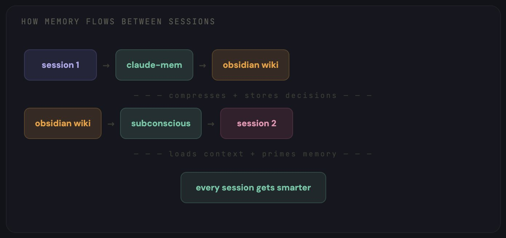

# 我把 Claude Code 变成了 24/7 全天候开发团队（完整指南 + 开源仓库）

大多数人把 **Claude Code** 当成一个聊天机器人来用。而我把它变成了一个 **24/7 全天候开发团队**：它记得所有事，而且每次会话都变得更聪明。

快收藏这篇，别忘了。

我连续三个月，**大规模地用错了 Claude Code**。

每次会话开头都一模一样：“我在用 TypeScript 写一个 React 应用，后端是 PostgreSQL，部署在 Vercel 上，这是我的目录结构……”

同样的解释，日复一日，天天重复。

然后我再手动敲一遍相同的 Prompt：“请 Review 这段代码”“为这段逻辑写测试”“修复 CI 流程”——对着一个关掉就忘光一切的终端，一遍遍输入大段文字。

我统计了一周：**每天平均浪费 47 分钟**，反复向一个本该“认识我”的工具解释我自己。

后来，我彻底推翻重做了整套工作流。

现在，**Claude Code 记得我做过的每一个技术决策**；  
它在我睡觉时并行运行 **5 个 Agent**；  
它**自动执行我的编码规范**，根本不用我提醒；  
而且它**越用越聪明**，而不是每次重启都归零。

整套系统，只要 **$20/月** 的订阅费。

下面就是我一步步搭建它的全过程：

## /part 1 — CLAUDE.md：改变一切的基础文件

这个文件，**90% 的用户要么跳过，要么写错**。

`CLAUDE.md` 放在项目根目录下。每次启动 Claude Code 会话时，它都会自动读取这个文件。这是你**一次性、永久性**告诉 Claude “我是谁、我在建什么、我希望事情怎么完成”的唯一方式。

大多数人写的是类似这样的内容：“这是一个 React 应用，请帮帮我。”

这完全没用。

真正起作用的写法如下：

```markdown
# CLAUDE.md

## project
- 技术栈：Next.js 14 + TypeScript + Tailwind + Prisma 连接 PostgreSQL  
- 部署平台：Vercel，staging 分支自动部署  
- 单体仓库（monorepo）结构：`/apps/web`、`/apps/api`、`/packages/shared`

## conventions（编码规范）
- 所有组件名使用 PascalCase  
- API 路由统一返回 `{ data, error }` 格式  
- 除页面文件（pages）外，禁用 default export  
- 测试文件与源码同目录，命名格式为 `*.test.ts`  
- 提交信息遵循 Conventional Commits（`feat:`、`fix:`、`chore:` 等）

## architecture decisions（架构决策）
- 2024 年 12 月选用 Prisma 而非 Drizzle：优先保障类型安全  
- 2025 年 1 月选用 Zustand 而非 Redux：减少样板代码  
- 认证方案用 Clerk，不用 NextAuth：更适配我们团队规模的开发体验（DX）

## current focus（当前重点）
- 将支付系统从 Stripe Checkout 迁移到 Stripe Elements  
- 对 `/dashboard` 页面做性能审计（目标：LCP < 2 秒）

## rules（硬性规则）
- 未经提前展示修改计划，禁止一次性批量修改超过 3 个文件  
- 编写新测试前，必须先运行现有测试  
- 若任务步骤超过 5 步，必须先生成一份 plan 文档
```

效果天差地别。你再也不用花每轮会话的前 5 分钟，反复解释项目背景——Claude 已经清楚知道你的技术栈、编码规范、历史架构决策，以及你当前正在攻坚什么。

但这只是开始。`CLAUDE.md` 是静态的：它不会学习，也不会成长。要实现持续进化，你需要下一层能力。

## /part 2 — 持久化记忆：永不遗忘的设置

这一部分彻底改变了我的体验。

默认情况下，Claude Code **完全没有跨会话记忆**。每次对话都是全新开始：你重复解释上下文、重复纠正相同问题、重复发现相同解法。

我用三款工具协同解决了这个问题：



**Obsidian 作为知识库**

我专门搭建了一个 Obsidian Vault，专用于开发工作——不是随手记的笔记，也不是书签收藏夹，而是一个**结构化的 Wiki**，Claude Code 可以读、也可以写。

目录结构如下：

```
/vault
  /decisions      — 每一项架构决策，附带背景和权衡过程  
  /errors         — 遇到过的 Bug 及其解决方案  
  /patterns       — 在我们代码库中验证有效的编码模式  
  /sessions       — 每日会话摘要（做了什么、结论是什么）  
  /stack          — 所有技术栈工具的使用文档  
  Memory.md       — “我是谁、我在建什么、我的偏好是什么”  
  index.md        — Vault 中所有内容的总索引
```

这个思路源自 Andrej Karpathy 提出的 **LLM Wiki 概念**：不再让 Claude 每次都从零重新发现知识，而是让它持续从一个长期演进、不断沉淀的 Wiki 中读取信息。

> https://github.com/karpathy/llm-wiki

**claude-mem：实现会话持久化记忆**

`claude-mem` 通过压缩机制提供长期记忆能力。每次会话结束时，它会将关键决策和上下文压缩后存入持久化存储，并自动带到下次会话中。

> https://github.com/thedotmack/claude-mem

**Subconscious Agent（潜意识 Agent）**

这个最神奇。`claude-subconscious` 是一个后台运行的 Agent，它默默监听你的会话、读取你的文件，并在你无感的情况下持续构建记忆。

就像背后坐着一位初级工程师，把你做的每件事都记下来。

> https://github.com/0xfurai/claude-subconscious

结果是：周一早上打开 Claude Code，它已经知道——  
✅ 周五我在调试支付 Webhook 的竞态条件；  
✅ 我决定把轮询（polling）换成 WebSocket；  
✅ 测试还没更新，这事还得做。

**完全不需要你解释。它就是知道。**

## /part 3 — Skills：把通才变成专家

开箱即用的 Claude Code 是个通才：啥都能干，但哪样都不够精。

**Skills（技能）** 改变这一点。它们是 Markdown 文件，用来教 Claude **按你的方式、精准执行特定任务**。

第一个你应该装的 Skill 是 **Superpowers**：

⭐️ GitHub 17 万+ Stars｜Anthropic 官方插件市场认证｜把 Claude Code 从“你让我写我就写”，升级为一套完整的开发方法论。

```bash
/plugin install superpowers@claude-plugins-official
```

它实际做的事是：Claude 不再直接写代码，而是强制走完整流程——  
**头脑风暴 → 编写需求规格（spec）→ 制定实施计划 → TDD 编写测试 → 实现功能 → 自动 Review**。  
它会先问你“你真正想构建的是什么？”，再输出一份供你确认的 spec；接着生成一份详细到能让初级工程师直接执行的 plan；最后用测试驱动的方式落地。

> https://github.com/obra/superpowers

装完 Superpowers 后，我又加了几个专业级 Skill：

> **Trail of Bits 安全 Skill** —— 由真实安全工程师打造的实战审计流程。每个 PR 在你点开前，就已经被自动扫描漏洞。

> https://github.com/trailofbits/claude-code-skills

> **Anthropic 官方 Skill** —— PDF / DOCX / XLSX 生成、数据分析等。所有其他 Skill 的权威参考基准。

> https://github.com/anthropics/skills

> **TDD-Guard** —— 自动拦截跳过测试的提交。Claude **根本无法提交未测代码**。它会明确告诉你为什么被拦截，以及需要补哪些测试。

> https://github.com/nizos/tdd-guard

你可以叠加任意多个 Skill，它们互不冲突。每个 Skill 让 Claude 在某一个领域更专业，合起来，就组成了一个**完全适配你个人工作流的专家级开发团队**。

## /part 4 — Subagents（子 Agent）：一个 Claude，变成五个

到这里，事情开始认真起来了。

单个 Claude Code 会话一次只能做一件事：你让它写功能 → 再让它 Review 代码 → 再让它修 Bug → 再让它写文档……它只能串行处理，到第四个任务时，上下文早已混乱不堪。

**Subagents 把工作拆开**。不再是那个超负荷的 Claude，而是一支分工明确的专家小队：每人只负责一件事，拥有专属上下文和权限边界。

我的配置包含 **5 个 Agent**：

- **Architect（架构师）**：负责高层设计决策、编写 spec、制定实施方案。**从不碰代码**。  
- **Coder（编码员）**：严格按 Architect 的 plan 写代码。拥有全部工具调用权限。  
- **Reviewer（评审员）**：以安全为第一视角 Review 每个 PR。标记风险、提改进建议、检查测试覆盖率。  
- **Tester（测试员）**：编写并运行测试，强制执行 TDD。与 `tdd-guard` 深度协作，确保无覆盖不发布。  
- **Ops（运维）**：负责部署、CI/CD、基础设施。监控构建状态，自动修复失败流水线。

每个 Agent 都有自己独立的 `CLAUDE.md`，定义专属指令、工具权限和上下文边界。  
Coder 永远看不到部署配置；Reviewer 永远不写代码。职责清晰，边界干净。

现成可用的 Agent 集合推荐：

> https://github.com/wshobson/agents —— 2.5 万+ Stars｜覆盖战略、开发、安全、设计等生产级 Subagent  
> https://github.com/davepoon/claude-code-subagents-collection —— 100+ Agent｜开箱即用，适配任意工作流

## /part 5 — Hooks（钩子）与 Slash Commands（斜杠命令）：自动化重复操作

**只要你发现自己第三次输入同一句指令，这就是一个 Slash Command 的信号。**

我日常高频使用的几个命令：

> `/fix-issue 456` —— 自动读取 GitHub Issue，创建分支，编写带测试的修复代码，并发起 PR。一条命令，代替 10 分钟手工流程。

> https://github.com/claude-commands/command-fix-issue

> `/review` —— 触发 Reviewer Agent，对当前 PR 执行安全扫描、测试覆盖率分析、代码质量打分。

> `/deploy staging` —— 通过 Ops Agent 全流程跑通 staging 部署流水线。

完整版 57 个生产就绪命令集合：

> https://github.com/wshobson/commands —— 1.7k+ Stars｜含 15 个 Workflow + 42 个工具

**Hooks 更进一步：它会在特定时刻自动触发。**

> **pre-commit hook（提交前钩子）** —— `tdd-guard` 自动检查：测试是否存在？是否通过？不满足则拒绝提交。  
> **session start hook（会话启动钩子）** —— 自动从 Obsidian 加载记忆、读取最近会话日志、预热上下文。  
> **pre-push hook（推送前钩子）** —— 代码推送到远程前，自动执行安全审查。

你不再需要提醒 Claude 你的规则——**规则自己执行自己**。

## /part 6 — Orchestration（编排）：你睡觉时，Agent 在干活

这是最后一块拼图。它让 $20/月 的订阅，真正变成一支“随时待命的开发团队”。

`claude-squad` 是一款专为 AI Agent 多开设计的终端多路复用器（terminal multiplexer）。每个 Agent 通过 Git worktree 拥有独立隔离的工作区，因此可并行操作不同分支，**零冲突**。

```bash
brew install claude-squad
cs
```

就这么简单。你会看到一个 TUI 界面，可以随时启动、监控、暂停或恢复任意 Agent。  
**关掉终端？Agent 继续运行。**  
第二天早上回来，PR 已就位。

> https://github.com/smtg-ai/claude-squad


睡前我打开 `claude-squad`，启动三个会话：

- Agent 1：`“修复仓库中所有标记为 'bug' 的未关闭 Issue”`  
- Agent 2：`“为 /apps/api/src/services/ 目录补全缺失的测试”`  
- Agent 3：`“用新设计 Token 重构 dashboard 组件”`

对可信任务启用自动接受模式（`cs -y`），对高风险任务切换至 plan 模式（先出方案再执行）。

合上笔记本，去睡觉。

早上醒来：**3 个 PR 已就绪，各自在独立分支，无冲突，测试全部通过。**

更高级的编排方案：

> https://github.com/ruvnet/claude-flow —— 11.4k+ Stars｜企业级多 Agent 编排框架，内置持久化记忆

## /part 7 — 全栈组成 & 成本明细

所有组件组合起来的样子：

```markdown
layer 1: CLAUDE.md              — 免费（只是一个文件）  
layer 2: Obsidian + claude-mem  — 免费（Obsidian 免费，相关开源仓库均 MIT）  
layer 3: Superpowers + Skills   — 免费（全部开源，MIT 协议）  
layer 4: Subagents              — 免费（纯 Markdown 文件）  
layer 5: Hooks + Commands       — 免费（全部开源）  
layer 6: claude-squad           — 免费（开源）

总基础设施成本：$0

Claude Code 订阅费：$20/月（Pro 计划）
```

列表中所有组件均为开源。你唯一付费的，只有 Claude Code 本身的订阅服务。

而投资回报率（ROI）更是惊人。我对比了这套系统上线前后两周的生产力数据：


我每天浪费的 47 分钟？消失了。但更重要的是：**Agent 现在凌晨 3 点就在做我过去下午 3 点才做的事**。

## /bonus — 从哪开始？

你**不需要今天就构建全部 6 层架构**

先从这三层入手。只需一个下午：


这个搭建方案，我花了 **3 个月** 才理清楚。

而你，**一个下午就能搭好**。

你现在的 Claude 代码环境长什么样？

关注我 @regent0x_，只研究、只分享最新、最硬核的 Alpha（前沿实践与洞见）  
感谢阅读。别忘了收藏这篇！